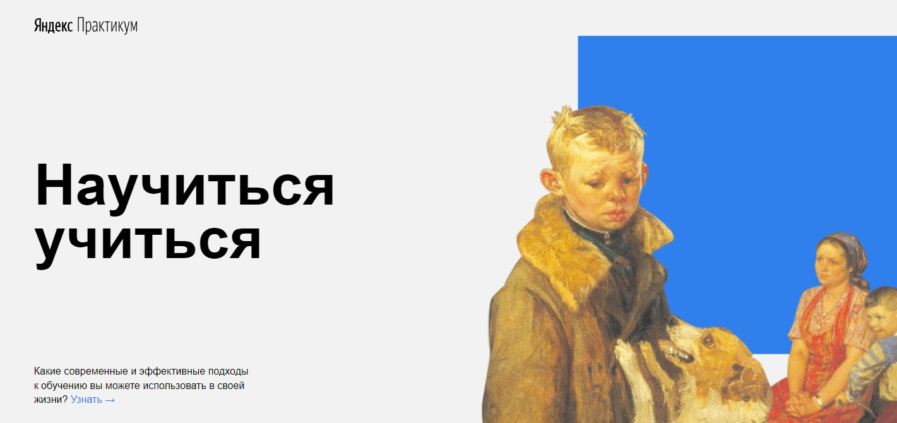

# How to learn
## About the project:
This page contains information on principles and techniques for learning something. The user can read the information about the topic, watch the video and go to social networks by clicking the links.
## HTML features in use:
- Semantic markup
- Embedding of multimedia
## CSS modules in use:
- Flexible Box Layout
- Positioning
- Box Model
- Animations
- Transitions
- Backgrounds and Borders
- Colors
- Fonts
## Future scope:
- Using media queries to modify the page depending on a device's specific characteristics and parameters (such as screen resolution or browser viewport width).
- Creation of new pages, the transition to which is supposed to be from this page:
    - Modern and effective learning approaches / Современные и эффективные подходы к обучению
    - Feynman's method / Метод Фенймана
- The transition to the website of the bookstore, where the user can buy the book by Salman Khan "The whole world is a school".
- The transition to the websites of "Arzamas", "N+1", "STRELKA" and "ПОЛКА".
- The transition to the pages "О Практикуме", "Главная", "Концепция", "Наставники".
